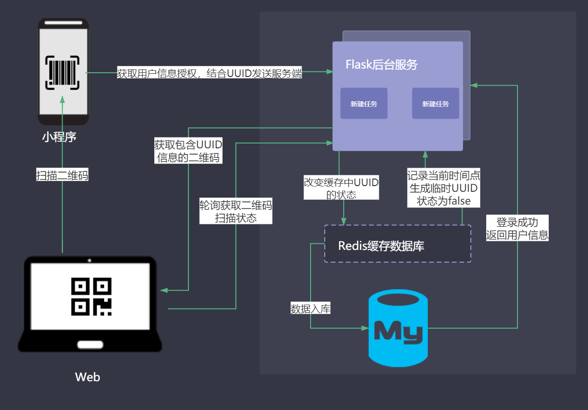

# 个人用户通过微信扫码登录网站的系统设计

通过手机微信扫码登陆，对用户来说是个十分便捷的功能，然而官方只对企业认证用户开放了接口，不过我们可以通过曲线救国的方式实现该功能。


# 背景

我有一个管理系统，希望只有我指定的人才能登陆使用，然而账号密码是会丢失的。所以手机微信扫码登陆成了我首选，不过没有企业认证用不了官方的接口。
还好，我也有自己的微信小程序，可以通过小程序来实现该功能。

# 系统架构



# 核心代码

## 服务端

服务端我采用的Flask框架，因为生成二维码很频繁且对即时性要求较高，我采用的Redis缓存数据库来记录。

```python
'''
Redis配置
'''
app.config['REDIS_HOST'] = "127.0.0.1" # redis数据库地址
app.config['REDIS_PORT'] = 6379 # redis 端口号
app.config['REDIS_DB'] = 0 # 数据库名
app.config['REDIS_EXPIRE'] = 60 # redis 过期时间60秒

```

每次用户打开web端的二维码登陆界面，都会触发服务端去生成一个以UUID为key的缓存数据存入redis,且为未登录状态
```python
@login.route("/qrlogin", methods=["GET", "POST"])
def qrlogin():
    uid = getUnquieUUID()
    setTime = int(round(time.time() * 1000))
    # 初始创建缓存数据
    setUUIDStatus(uid, 0, None, setTime)
    qrcode_str = set_qrcode(url="{0}".format(uid))
    return make_response(jsonify({'code': 0, 'content': {'loginCode': qrcode_str.decode('utf-8'), 'loginId': uid}, 'msg': ''}))

```

小程序端提供一个扫码入口，扫指定的信息后，可以连同小程序中获取的用户信息一起发送给服务端，服务端根据信息中key及用户信息，来校验，并入库保存信息。
```python
@login.route("/accpetLogin", methods=["GET", "POST"])
def accpetLogin():
    uuid = request.json.get('uuid')
    userName = request.json.get('userName')
    uuInfo = getUUIDInfo(uuid)
    if not uuInfo:
        return make_response(jsonify({'code': 10002, 'content': {}, 'msg': '别偷东西！'}))
    nowTime = int(round(time.time() * 1000))
    if nowTime - uuInfo['setTime'] > 300000:
        return make_response(jsonify({'code': 10002, 'content': {}, 'msg': '验证码已失效，请刷新重新扫描！'}))
    setUUIDStatus(uuid, 1, userName, nowTime)
    return make_response(jsonify({'code': 0, 'content': {}, 'msg': '登录成功！'}))
```

web页面会一直轮询检查该二维码的扫码状态，如果被扫成功了，则会带着扫码人信息进入应用。
```python
@login.route("/getCodeStatus", methods=["POST"])
def getCodeStatus():
    uuid = request.json.get('loginId')
    uuInfo = getUUIDInfo(uuid)
    if not uuInfo:
        return make_response(jsonify({'code': 10002, 'content': {}, 'msg': '别偷东西！'}))
    if uuInfo['status'] == 1:
        return make_response(jsonify({'code': 0, 'content': {'userName': uuInfo['userName']}, 'msg': '登录成功！'}))
    nowTime = int(round(time.time() * 1000))
    if nowTime - uuInfo['setTime'] > 300000:
        return make_response(jsonify({'code': 10002, 'content': {}, 'msg': '验证码已失效，请刷新重新扫描！'}))
    return make_response(jsonify({'code': 10002, 'content': {}, 'msg': '等待验证！'}))
```

## web端

web主要是取做获取验证码和检查验证状态，我用的是DVA，处理方法主要在models里。
前端的事件：
```javascript
queryGetLoginQr = () => {
    const { dispatch } = this.props;
    dispatch({
      type: 'login/queryGetLoginQr',
    })
      .then(() => {
        const { userLogin: { codeInfo } } = this.props;
        this.setState({ codeInfo }, () => {
          this.Timer = setInterval(() => {
            this.queryGetCodeStatus()
          }, 1000);
        })
      })
  };

  queryGetCodeStatus = () => {
    const { dispatch } = this.props;
    const { userLogin: { codeInfo } } = this.props;
    dispatch({
      type: 'login/queryGetCodeStatus',
      payload: {
        loginId: codeInfo.loginId,
      },
    })
  }
```

models:
```javascript
    *queryGetLoginQr({ payload }, { call, put }) {
      yield put({ type: 'updateState', payload: { loginCode: null } });
      const res = yield call(queryGetLoginQr, payload);
      if (res) {
        yield put({ type: 'updateState', payload: { codeInfo: res.content } });
      }
    },

    *queryGetCodeStatus({ payload }, { call, put }) {
      yield put({ type: 'changeLoginStatus', payload: { status: 'err', currentAuthority: 'guest' } });
      const res = yield call(queryGetCodeStatus, payload);
      if (res && res.code === 0) {
        yield put({ type: 'changeLoginStatus', payload: { status: 'ok', currentAuthority: 'admin' } });
        const urlParams = new URL(window.location.href);
        const params = getPageQuery();
        let { redirect } = params;
        if (redirect) {
          const redirectUrlParams = new URL(redirect);
          if (redirectUrlParams.origin === urlParams.origin) {
            redirect = redirect.substr(urlParams.origin.length);
            if (redirect.match(/^\/.*#/)) {
              redirect = redirect.substr(redirect.indexOf('#') + 1);
            }
          } else {
            window.location.href = '/';
            return;
          }
        }
        yield put(routerRedux.replace(redirect || '/'));
      }
    },
```

## 小程序端
小程序端是比较简陋的demo，不用在意样式，核心就是扫码获取信息。我用的Taro框架，还是react语法。
其中的允许登录按钮应该结合获取用户信息的type来写，需要的自己完善下。

```javascript
  handleScan = () => {
    Taro.scanCode()
      .then(res =>{
        this.setState({uuid: res.result});
      })
  }

  handleAccpetLogin = () => {
    const { uuid } = this.state;
    const { dispatch } = this.props;
    dispatch({
      type: 'system/queryAccpetLogin',
      payload: {
        uuid,
        userName: 'laochen'
      }
    })
  }

  render () {
    const { uuid } = this.state;
    return (
      <View className='index'>
        {uuid && (
          <Text>是否允许PC端登录？</Text>
        )}
        <Button onClick={()=>this.handleScan()}>扫码</Button>
        {uuid && (
          <Button onClick={()=>this.handleAccpetLogin()} type='primary'>允许登录</Button>
        )}
      </View>
    )
  }
```

# 结束

项目完整代码：https://github.com/t880216t/wxQrloginWeb
后续还将加上图形验证码功能。
